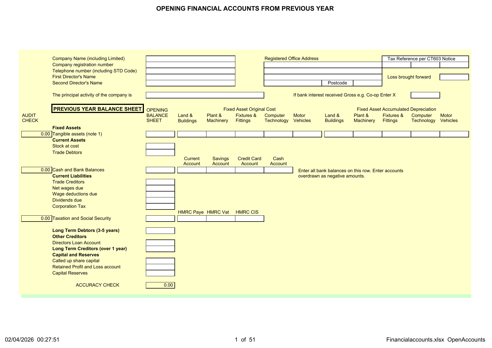
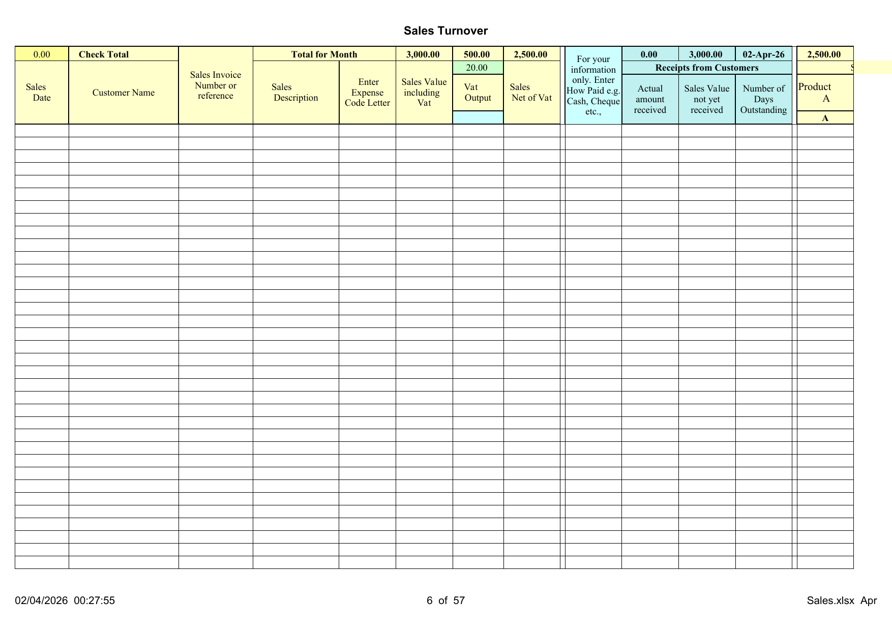
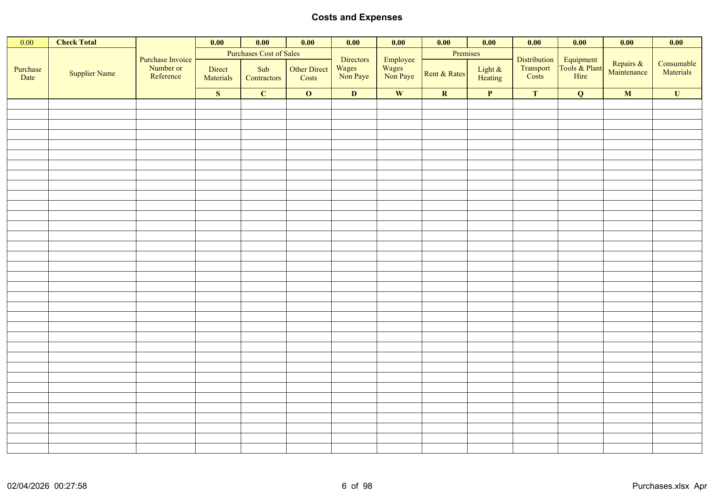
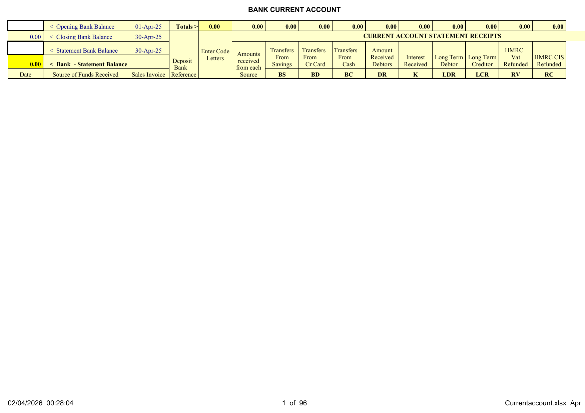
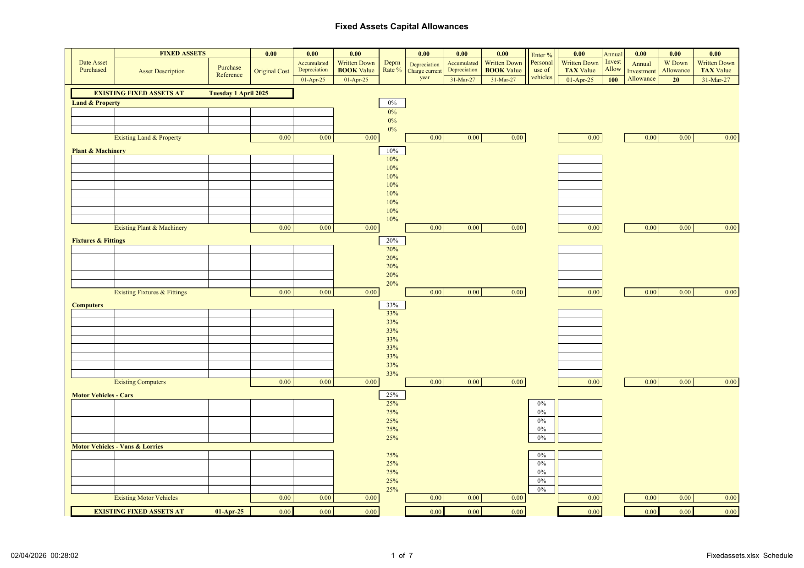
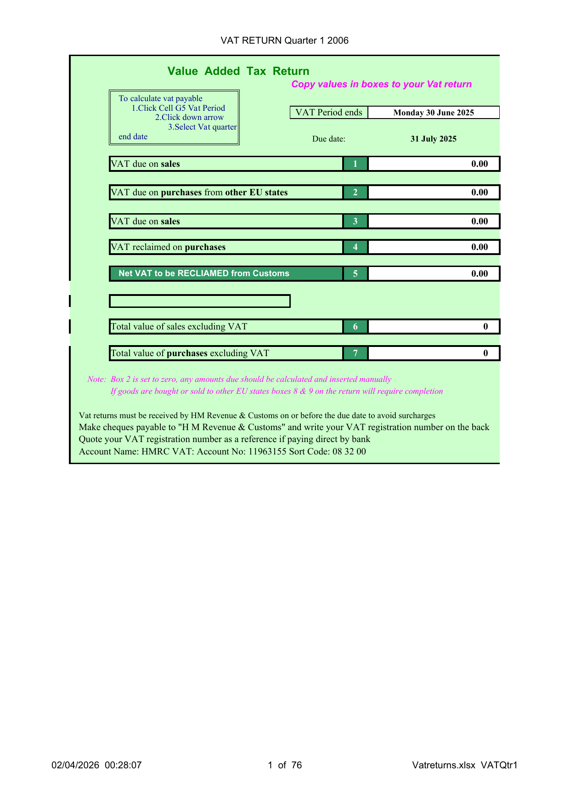

# DIY Accounting Company Accounts User Guide

Thank you for using DIY Accounting as your limited company accounting system.

**Note:** This package supports the **small profits Corporation Tax rate** (19%) for companies with taxable profits up to £50,000. Companies with profits above £50,000 should seek professional advice regarding marginal relief and the main CT rate (25%).

Written upon Excel spreadsheets, the Limited Company accounting system is based upon double entry accounting principles which has been automated through use of Excel formulae, significantly reducing the need for bookkeeping or accounting knowledge with all double entries automated.

Entering the data is no more complicated than entering your financial information in 3 lists:

- Enter sales receipts on the **Sales** spreadsheet
- Enter purchases on the **Purchases** spreadsheet
- Enter cash and bank transactions on the preset **Cash and Bank** spreadsheets

The package produces automated monthly profit and loss accounts, live debtor and creditor reports, automated VAT returns, and a set of annual accounts ready for publication and submission to Companies House and HMRC.

## Contents

- [Preparing to Get Started](#preparing-to-get-started)
- [Value Added Tax](#value-added-tax)
- [Protection and Parameters](#protection-and-parameters)
- [Sales Spreadsheet](#sales-spreadsheet)
- [Purchases Spreadsheet](#purchases-spreadsheet)
- [Expenses Claim Form](#expenses-claim-form)
- [Cash and Bank Spreadsheets](#cash-and-bank-spreadsheets)
- [Fixed Assets](#fixed-assets)
- [VAT Returns](#vat-returns)
- [Payroll Integration](#payroll-integration)
- [Financial Accounts](#financial-accounts)
- [Submission Documents](#submission-documents)
- [Sales Invoice](#sales-invoice)
- [Contact Information](#contact-information)

## Preparing to Get Started

### Package Contents

| File | Purpose |
|------|---------|
| **Sales.xlsx** | Monthly sales records with opening/closing debtors |
| **Purchases.xlsx** | Monthly purchase records with opening/closing creditors |
| **Currentaccount.xlsx** | Current account bank reconciliation |
| **Savingaccount.xlsx** | Savings account reconciliation |
| **Cashaccount.xlsx** | Cash account reconciliation |
| **Creditcardaccount.xlsx** | Credit card reconciliation |
| **Financialaccounts.xlsx** | Trial balance, P&L, balance sheet, corporation tax, CT600 |
| **Vatreturns.xlsx** | Five quarterly VAT returns |
| **Payslips.xlsx** | Payroll payslip generator |
| **Fixedassets.xlsx** | Fixed asset schedule, depreciation, capital allowances |
| **Companysecretary.xlsx** | Board minutes, directors register, members register |
| **Salesinvoice.xlsx** | Sales invoice template |
| **expensesform.xlsx** | Monthly expense claim forms |
| **Dividend Voucher.docx** | Dividend voucher template |

### Corporate Details

Enter the company name, director name, registered office and number at Financialaccounts > OpenAccounts.

Limited companies are required to keep a set of statutory books at Companysecretary. The Companysecretary > Boardmeeting worksheet is where the dividend declared for the current financial year is entered.

### Previous Year Accounts

As all companies are required to produce a Balance Sheet each year, opening balances need to be entered before live transactions. Enter balance sheet details at Financialaccounts > OpenAccounts in Column E and subtotals in Columns G to O.

### Opening Fixed Assets

Enter original cost and accumulated depreciation totals at Financialaccounts > OpenAccounts, then detailed information at Fixedassets > Schedule in the EXISTING FIXED ASSETS section.

### Back Up

Back up files regularly by emailing them to yourself weekly. Store in a separate mail folder for easy retrieval.

## Value Added Tax

**VAT registered business:** No adjustment entries required. VAT is automatically collected at 20%.

**Non VAT registered:** Go to Sales Spreadsheet Column G Row 2 Cell G2 and enter 0. The Purchases spreadsheet automatically adopts the same rate.

**Flat Rate VAT:** Go to Sales Spreadsheet Column G Row 4 Cell G4 and enter the flat rate percentage.

**VAT Cash Accounting Scheme:** Enter transactions in the month they are paid, not when invoiced.

## Protection and Parameters

**Date format:** Enter dates as DD/MM/YY. The format dd.mm.yy is not recognised.

### Worksheet Protection

| Level | Description |
|-------|-------------|
| Unprotected | Sales, Purchases, Cash and Bank, Fixed Assets, Company Secretary |
| Protected | Financial Accounts Trial Balance, Corporation Tax, CT600 |
| Password Protected | Financial Accounts Admin (dates and tax rules) |

### Formulae Parameters

| Workbook | Row limit |
|----------|-----------|
| Sales | Row 300 |
| Purchases | Row 300 |
| Cash and Bank | Row 200 |

## Sales Spreadsheet

Record income from all sources, except bank interest received, in the Sales workbook.

### Data Entry

| Column | Entry |
|--------|-------|
| **A** | Date of sale (DD/MM/YY) |
| **B** | Customer name |
| **C** | Invoice number |
| **D** | Description (optional) |
| **E** | Code letter (see below) |
| **F** | Gross amount including VAT |
| **G** | No entry -- VAT calculated automatically |
| **H** | No entry -- net amount calculated |
| **J** | How paid (Cash, Cheque, etc.) |
| **K** | Amount received |

### Sales Code Letters

| Code | Meaning |
|------|---------|
| **A** | Sales turnover Product A |
| **B** | Sales turnover Product B |
| **C** | Sales turnover Product C |
| **D** | Other Direct Income |
| **G** | Investment Grants |
| **O** | Bad Debt written off (6+ months outstanding) |
| **FS** | Value of Fixed Assets Sold |

### Opening and Closing Debtors

**OpeningDebtors**: enter outstanding invoices from the previous year. **ClosingDebtors**: at year end, copy items still outstanding from each month.

## Purchases Spreadsheet

Record expenses from all sources, except bank interest and charges, in the Purchases workbook.

### Data Entry

| Column | Entry |
|--------|-------|
| **A** | Date of purchase |
| **B** | Supplier name |
| **C** | Invoice number |
| **D** | Description (optional) |
| **E** | Code letter (see below) |
| **F** | Gross amount including VAT |
| **G** | No entry -- VAT calculated |
| **H** | No entry -- net amount calculated |
| **J** | How paid |
| **K** | Amount paid |

### Purchase Code Letters

| Code | Meaning |
|------|---------|
| **S** | Direct materials for resale |
| **C** | Sub-contractor services |
| **O** | Other direct costs |
| **D** | Directors wages (not in PAYE) |
| **W** | Employee wages (not in PAYE) |
| **R** | Premises rent and rates |
| **P** | Light, heating, power |
| **T** | Distribution and transport |
| **Q** | Equipment, tools, plant hire |
| **M** | Repairs and maintenance |
| **U** | Consumable materials |
| **A** | Advertising and promotion |
| **G** | General admin (telephone, postage, stationery) |
| **H** | Travel and hotel expenses |
| **V** | Motor vehicle expenses |
| **N** | Insurance costs |
| **F** | Leasing charges |
| **L** | Legal and professional fees |
| **Y** | Charitable donations |
| **Z** | Goodwill |
| **FA** | Fixed asset purchases |

## Expenses Claim Form

Twelve monthly expense claim forms are included in expensesform.xlsx. Enter mileage, expense type, total claimed, and VAT. The form calculates mileage allowance at 45p per mile.

## Cash and Bank Spreadsheets

Four account workbooks are provided: Currentaccount, Savingaccount, Creditcardaccount, Cashaccount.

### Bank Reconciliation

| Cell | Entry |
|------|-------|
| **A1** | Opening bank balance (first month only) |
| **A2** | Closing balance (auto-calculated) |
| **A3** | Statement balance from bank |
| **A4** | Reconciliation difference (auto-calculated) |

### Current Account Receipt Codes

| Code | Meaning |
|------|---------|
| **BS** | Transfer from Savings |
| **BD** | Transfer from Credit Card |
| **BC** | Transfer from Cash |
| **DR** | Receipts from debtors |
| **K** | Bank interest received |
| **LDR** | Long term debtor repayment |
| **LCR** | Long term creditor received |
| **RV** | HMRC VAT refund |
| **RC** | HMRC CIS refund |
| **DL** | Directors loan credit |
| **X** | Contra (same month receipt and payment) |

### Current Account Payment Codes

| Code | Meaning |
|------|---------|
| **BS** | Transfer to Savings |
| **BD** | Transfer to Credit Card |
| **BC** | Transfer to Cash |
| **CR** | Payments to creditors |
| **W** | Net wages paid |
| **J** | Bank interest charged |
| **B** | Bank charges |
| **LDR** | Long term debtor payment |
| **LCR** | Long term creditor repayment |
| **RP** | HMRC PAYE payment |
| **RV** | HMRC VAT payment |
| **RC** | HMRC CIS payment |
| **RT** | HMRC Corporation Tax payment |
| **DV** | Dividend payment |
| **DL** | Directors loan payment |
| **X** | Contra |

Savings, Credit Card, and Cash accounts follow the same pattern with account-specific transfer codes.

## Fixed Assets

### Depreciation Rates

| Category | Rate |
|----------|------|
| Land & Buildings | 0% |
| Plant & Machinery | 10% |
| Fixtures & Fittings | 20% |
| Computer Equipment | 33% |
| Motor Vehicles | 25% |

### Fixed Asset Additions

Enter purchases on the Purchases spreadsheet with code **FA**, then also enter on Fixedassets > Schedule in the New Assets section (Row 56+).

### Capital Allowances

Annual Investment Allowance, writing down allowances, and balancing charges are automatically calculated. Motor vehicles are restricted to a writing down allowance of £3,000 p.a.

## VAT Returns

No entries required. Five automated returns provided. To generate: go to VATQtr1, click Cell G5, select the quarter-end date from the dropdown.

## Payroll Integration

The Financialaccounts file contains a WagesInterface for manual entry. The Payslips file provides automatic integration when saved to the same folder.

### Wages Interface

| Column | Entry |
|--------|-------|
| **C** | Gross Wages (Employees and Directors separately) |
| **D** | Income Tax deducted |
| **E** | National Insurance deducted |
| **F** | Other Deductions |
| **G** | Net Wages (auto-calculated) |
| **H** | Employers National Insurance |
| **I** | Statutory Deductions recoverable from HMRC |

## Financial Accounts

### Stock Control

Cells H4 N4 T4 preset to 0% (disabled). Enter actual stock percentage to enable. Cell AB30 for year-end physical stock value.

### Trial Balance

No entries required. Check Row 91 for zero (audit accuracy check). All data flows automatically from the prime entry worksheets.

### Monthly P&L (MnthP&L)

No entries required. Auto-generated from the Trial Balance each month.

### Published P&L (PubP&L)

No entries required. Statutory format for Companies House and HMRC submission.

### Published Balance Sheet (PubBalSht)

No entries required except Director Signature. Must be signed by a named director before submission.

### Published Notes (PubNotes)

No entries required. Notes detailing fixed assets, directors emoluments, dividends, and corporation tax.

### Corporation Tax

No entries required. Corporation Tax for small companies is calculated at the small profits rate (19%). The net bank interest is automatically grossed up for CT purposes.

### CT600

No entries required. Excel copy of the official CT600 tax return, auto-populated from the Corporation Tax sheet.

## Submission Documents

### Companies House (online)

Use the CorporationTax and CT600 sheets in Financialaccounts.xlsx to review your CT600 data before filing online.

### Companies House (paper)

Submit: Report (title page), PubP&L, PubBalSht (signed), PubNotes.

### HMRC (paper)

Submit the above 4 documents plus Corporation Tax calculation and CT600.

## Sales Invoice

The Salesinvoice workbook is independent. Set up Business Details, Customer Details, Product Details, then use Invoice Database to generate invoices.

## Contact Information

Our website: http://www.diyaccounting.co.uk/

Discussion forum: https://github.com/support-at-diyaccounting/spreadsheets.diyaccounting.co.uk/discussions

Donate: https://www.paypal.com/donate/?hosted_button_id=XTEQ73HM52QQW
