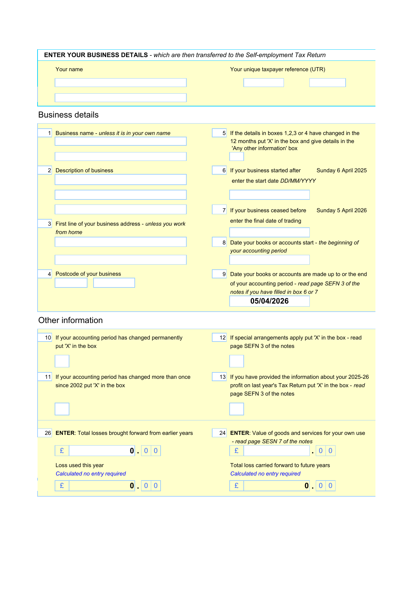
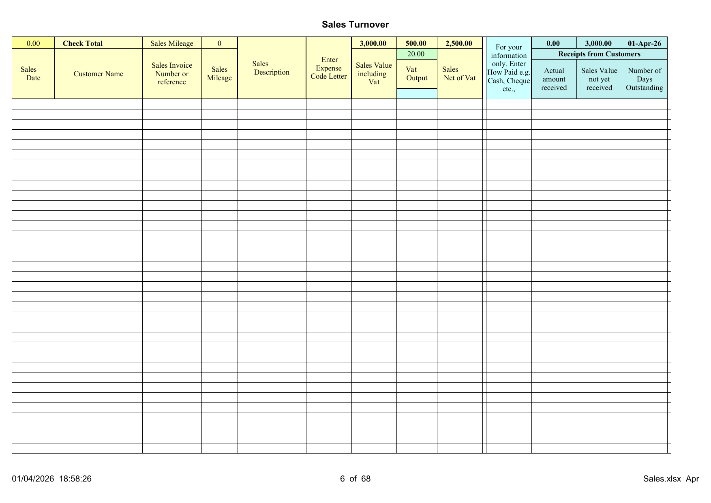
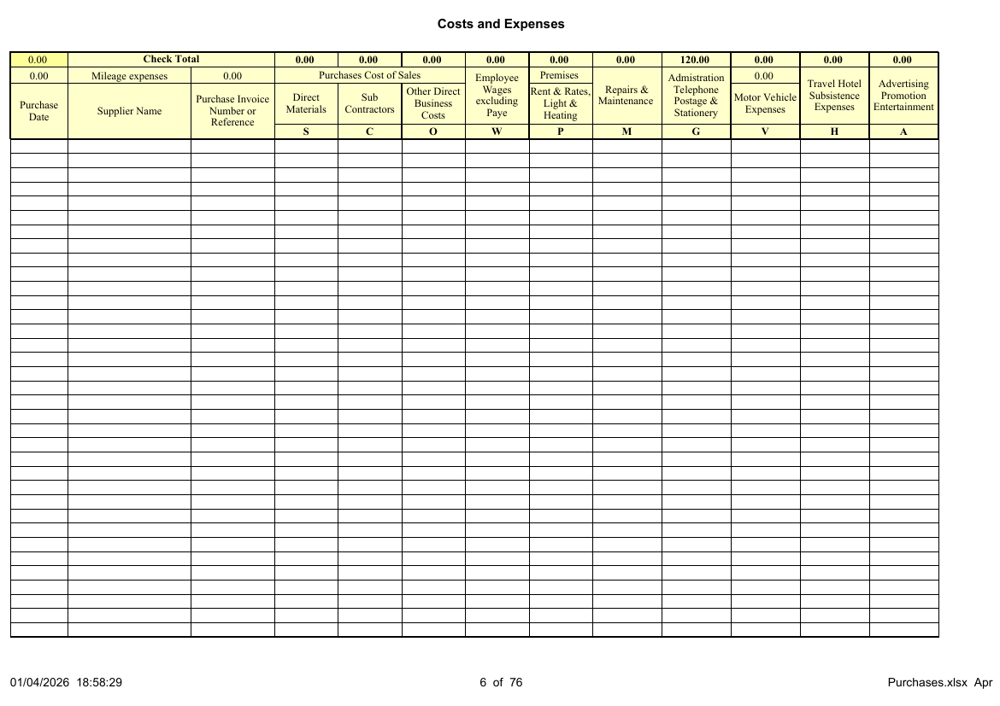
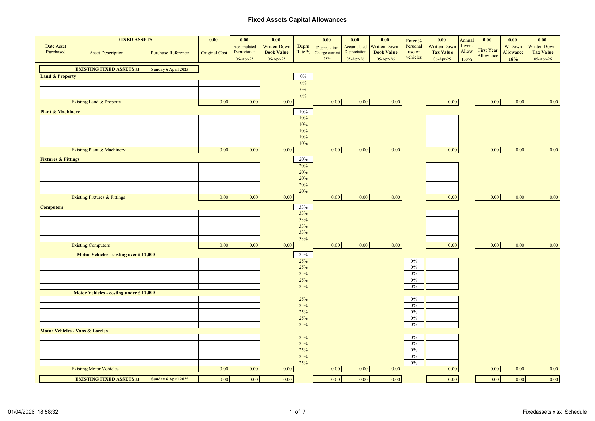
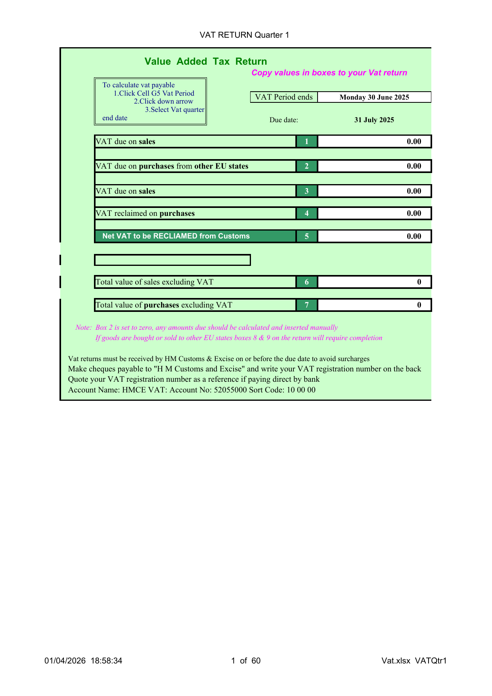
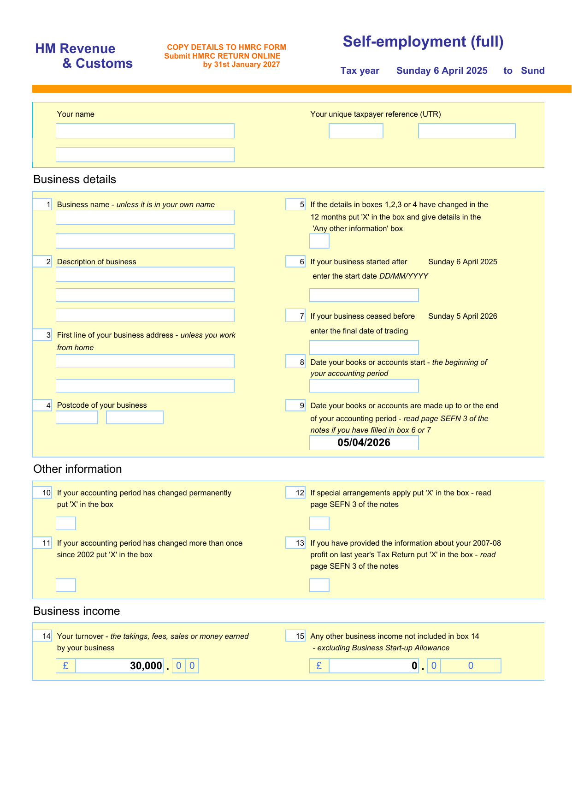
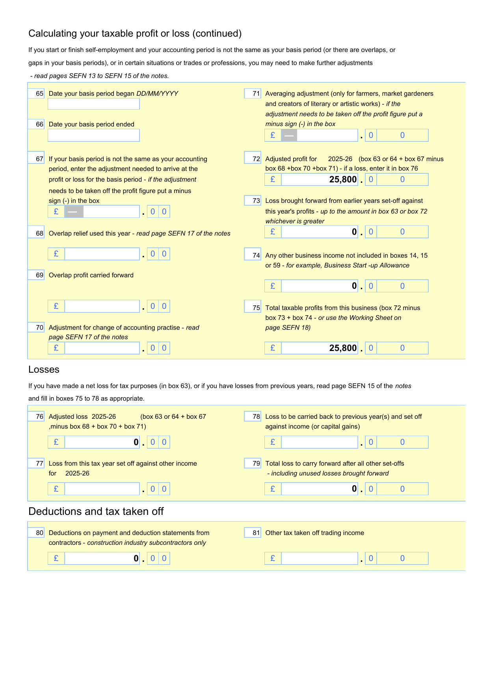

# DIY Accounting Self Employed User Guide

Thank you for using DIY Accounting as your self employed accounting system.

Written upon Excel spreadsheets, the Self Employed accounting system is based upon single entry accounting principles which has been automated through use of Excel formulae, significantly reducing the need for bookkeeping or accounting knowledge with all accounting entries automated.

Entering the data is no more complicated than entering your financial information in 3 lists:

- Enter sales receipts on the **Sales** spreadsheet
- Enter purchases on the **Purchases** spreadsheet
- Enter cash and bank transactions on the preset **Cash** and **Bank** spreadsheets

The package contains many features including automated calculation of tax allowances, income tax, stock control and an all important payroll interface which permits the package to be used with or without the automated Payroll Software.

## Contents

- [Preparing to Get Started](#preparing-to-get-started)
- [Value Added Tax](#value-added-tax)
- [Protection and Parameters](#protection-and-parameters)
- [Sales Spreadsheet](#sales-spreadsheet)
- [Purchases Spreadsheet](#purchases-spreadsheet)
- [Cash and Bank Spreadsheets](#cash-and-bank-spreadsheets)
- [Fixed Assets](#fixed-assets)
- [VAT Returns](#vat-returns)
- [Payroll Integration](#payroll-integration)
- [Financial Accounts](#financial-accounts)
- [Sales Invoice](#sales-invoice)
- [Contact Information](#contact-information)

## Preparing to Get Started

### Download and Install

1. Go to the download page on the DIY Accounting website.
2. Download the package for your version of Excel.
3. Save the zip file to a location on your computer, ideally in your Documents folder.
4. Extract the contents of the zip file to a new folder by right clicking on the zip file and selecting "Extract All".
5. Open the extracted folder -- you will find the spreadsheet files and this guide.

**Important:** When downloading the files do not open the files before saving to your DIY Accounting folder. Opening a file first before saving creates temporary links between the files. Save all files directly to the accounts folder without opening the files first.

### Package Contents

The Self Employed package contains these files:

| File | Purpose |
|------|---------|
| **Sales.xlsx** | Monthly sales records (Apr--Mar) with opening/closing debtors |
| **Purchases.xlsx** | Monthly purchase records (Apr--Mar) with opening/closing creditors |
| **Bank.xlsx** | Monthly bank reconciliation (Apr--Mar) |
| **Cash.xlsx** | Monthly cash reconciliation (Apr--Mar) |
| **Financialaccounts.xlsx** | P&L, Income Tax, SE returns, stock control, wages interface |
| **Vat.xlsx** | Five quarterly VAT returns with automated Vat interface |
| **Payslips.xlsx** | Payroll payslip generator (optional) |
| **Fixedassets.xlsx** | Fixed asset schedule, depreciation, capital allowances |
| **Salesinvoice.xlsx** | Sales invoice template with customer/product database |

### Previous Year Accounts

As Self Employed businesses are not required to produce a Balance Sheet each year, entering previous year balances is optional. Entering previous year fixed assets is important to correctly calculate capital allowances due.

**Opening Fixed Assets:** Enter the original cost and accumulated depreciation totals for each category of fixed asset on the Fixedassets > Schedule in the top section headed EXISTING FIXED ASSETS.

**Sales not yet received:** To track money still owed from the previous year, enter outstanding invoices on Sales > OpeningDebtors.

**Purchases not yet paid:** To track money owed to suppliers from the previous year, enter outstanding invoices on Purchases > OpeningCreditors.

### Back Up

It is important to back up data at regular intervals. It is recommended that the files are backed up each week by emailing the files to yourself and then filing the most recently emailed files in a separate folder in your mail box.

## Value Added Tax

**Non VAT registered Business:** To disable VAT calculation throughout the accounting system, go to Sales Spreadsheet Column H Row 2 Cell H2 and enter 0, and do the same on the Purchases Spreadsheet.

**VAT Registration during the financial year:** Go to Sales Spreadsheet Column H Row 2 Cell H2 in the month vat registration is effective. Enter 17.5 to overwrite the vat rate of 0%. Do the same on the Purchases Spreadsheet. VAT will then be automatically collected and recorded on the vat returns from that month onwards.

**Flat Rate VAT registered Business:** Businesses with turnover under the flat rate threshold may adopt a flat rate vat scheme. When a flat rate scheme is adopted, go to Sales Spreadsheet Column H Row 4 Cell H4 and enter the flat rate percentage. Go to Purchases Spreadsheet Column H Row 2 Cell H2 which should be changed to zero.

## Protection and Parameters

### Worksheet Protection

Three levels of protection may be applied to worksheets:

| Level | Description |
|-------|-------------|
| Unprotected | Manual entries to cells overwrite formulae in that cell |
| Protected | Manual entries are not permitted to preserve formulae |
| Password Protected | No entries required |

Main data entry workbooks are **Unprotected**: Sales, Purchases, Cash and Bank, Fixed Assets, Financial Accounts Wages Interface.

Workbooks requiring none or occasional entries are **Protected**: Vat Returns, Stock Control.

**Password Protected files:** Self assessment tax return.

### Formulae Parameters

Row 1 of the main data entry workbooks contains formulae that sum the contents of each column:

| Workbook | Rows summed |
|----------|-------------|
| Sales | to Row 300 |
| Purchases | to Row 300 |
| Cash and Bank | to Row 200 |

Data entries below these row limits will not be included in the column totals unless the formulae in Row 1 are amended.

## Sales Spreadsheet

Record income from all sources, except bank interest received, in the Sales workbook using the separate spreadsheet provided for each month.

Enter sales credit notes and bad debts written off as negative amounts.

### Data Entry

| Column | Entry |
|--------|-------|
| **A** | Date of the sales transaction |
| **B** | Customer name or source of sale |
| **C** | Reference or invoice number |
| **D** | Mileage incurred in connection with the sale (optional) |
| **E** | Description of the monies receivable (optional) |
| **F** | Code letter to analyse the type of income (see below) |
| **G** | Total amount receivable including any VAT chargeable |
| **H** | No entry required -- formulae calculate VAT output tax |
| **I** | No entry required -- formulae calculate net sales value |
| **K** | Cash or Bank accounting source of the amount received |
| **L** | Actual amount received |

### Sales Code Letters

Enter in Column F:

| Code | Meaning |
|------|---------|
| **A** | Sales turnover Product A |
| **B** | Sales turnover Product B |
| **C** | Sales turnover Product C |
| **D** | Other Direct Income |
| **G** | Investment Grants and Government incentive schemes |
| **O** | Bad Debt written off (outstanding 6+ months) |
| **FS** | Value of Fixed Assets Sold |

### Row One Totals

Each column is totalled to row 300 and collected on Financialaccounts > Monthly P&L to produce the monthly and annual profit and loss account and self assessment return.

### Opening and Closing Debtors

The **OpeningDebtors** worksheet maintains continuity of financial control for amounts due to the business from the previous year. The **ClosingDebtors** worksheet is used at year end -- copy and paste items still outstanding from each month.

## Purchases Spreadsheet

Record expenses from all sources, except bank interest and charges, in the Purchases workbook using the separate spreadsheet provided for each month.

Enter purchase credit notes as negative amounts.

### Data Entry

| Column | Entry |
|--------|-------|
| **A** | Date of the purchase transaction |
| **B** | Supplier name or source of purchase |
| **C** | Reference or purchase invoice number |
| **D** | Mileage incurred in connection with the purchase (optional) |
| **E** | Description of the business expense (optional) |
| **F** | Code letter to analyse the type of expense (see below) |
| **G** | Total amount payable including any VAT chargeable |
| **H** | No entry required -- formulae calculate VAT input tax |
| **I** | No entry required -- formulae calculate net purchase value |
| **K** | Cash or Bank accounting source of the amount paid |
| **L** | Actual amount paid |

### Purchase Code Letters

Enter in Column F:

| Code | Meaning |
|------|---------|
| **S** | Direct Materials purchased for resale including stock |
| **C** | Sub Contractor services resold to generate sales turnover |
| **O** | Other Direct Costs -- any other cost of sales purchases |
| **W** | Employees gross wages not included in the PAYE system |
| **P** | Premises -- rent, business rates, water rates, power costs |
| **M** | Repairs and Maintenance of business premises and equipment |
| **G** | General Administrative -- telephone, postage, stationery |
| **V** | Motor Vehicle -- fuel, tax, insurance, repairs |
| **H** | Travel and Hotel business expenses |
| **A** | Advertising, promotion and entertainment expenses |
| **L** | Legal and professional fees -- accountants, solicitors, licences |
| **Y** | Other Expenses (use alternative category where possible) |
| **FA** | Fixed Asset purchases |

### Tax Hints

- Every expense item should ideally be receipted
- Mileage records have to be maintained showing date of journey, reason for journey and mileage covered
- Only the business element of phone bills may be reclaimed
- Only the business element of household bills may be claimed
- Mileage allowances of 45p for the first 10,000 miles and 25p per mile thereafter may be claimed as an alternative to vehicle running costs

## Cash and Bank Spreadsheets

Sales and expenses are recorded on the Sales and Purchases workbooks not the Cash and Bank records. Entries to the Sales and Purchases workbooks create accounts of money owing. Entries to the Cash and Bank records are used to record the receipts from Debtors to Creditors.

As Balance Sheets by Self Employed businesses are optional, recording cash and bank is also optional.

### Bank Reconciliation

| Cell | Entry |
|------|-------|
| **A1** | Enter the actual bank balance at the beginning of the first month |
| **A2** | No entries required -- automatically calculates closing balance |
| **A3** | Enter the bank balance as shown on the bank statement |
| **A4** | No entries required -- calculates Bank Reconciliation difference |

### Bank Receipts (Columns A--F)

| Column | Entry |
|--------|-------|
| **A** | Date of the bank receipt |
| **B** | Source of the funds received |
| **C** | Sales invoice reference |
| **D** | Bank deposit reference (optional) |
| **E** | Code letter (BC, DR, CR, K, RV, DL, X) |
| **F** | Amount deposited |

### Bank Payments (Columns O--T)

| Column | Entry |
|--------|-------|
| **O** | Date of the bank payment |
| **P** | Name of supplier or creditor paid |
| **Q** | Purchase invoice reference |
| **R** | Cheque number or reference (Bacs, DD) |
| **S** | Code letter (BC, CR, DR, W, B, J, RP, DL, X) |
| **T** | Amount paid |

## Fixed Assets

Fixed items are physical items not bought for resale but used by the business for a period of more than one year.

### Depreciation Rates

The following depreciation rates have been preset:

| Category | Rate |
|----------|------|
| Land & Buildings | 0% |
| Plant & Machinery | 10% |
| Fixtures & Fittings | 20% |
| Computer Equipment | 33% |
| Motor Vehicles | 25% |

### Fixed Asset Additions

Expenditure on Fixed assets is recorded on the Purchases worksheet with code **FA**. All items entered on the Purchases spreadsheet also have to be manually entered on the Fixedassets > Schedule in the New Assets section which starts at Row 56.

### Capital Allowances

Annual Investment allowances, first year allowances, writing down allowances and balancing charges are automatically calculated using the current tax rates which have been preset.

### Fixed Assets Reconciliation

Fixedassets > FAreconciliation compares Fixed Asset Purchases and Sales entered on the Fixedassets > Schedule to indicate that all entries have been included. If Row 15 is zero, all records have been entered accurately.

## VAT Returns

No entries required. Sales and Purchase totals are collected by the Vatinterface. Five automated Vat Returns are provided for each of the potential quarters during the financial year.

To Generate a Vat Return:

1. Go to Vatreturns > VATQtr1
2. Click Cell G5 which contains the date to which the vat return is to be produced
3. Click the Drop Down Arrow to the right of Cell G5
4. Scroll Down and Click the month end date required

The formula then automatically looks up the values and inserts the amounts in the vat return.

## Payroll Integration

The Financialaccounts file contains a WagesInterface which can be entered manually if users are not using the DIY Accounting Payroll Software.

The Payslips file is provided as a payslip generator (see separate Payslip User Guide for instructions). Using the payslip generator provides automatic integration with the Accounting Software as the WagesInterface is linked directly from these files.

## Financial Accounts

### Stock Control

The Stock Control worksheet is for businesses that carry physical stock of goods for resale. Cells H4 N4 T4 have been preset to 0% which disables the Stock Control feature. Enter the actual percentage of stock value to enable.

Cell D6 and Cell AB6 -- Opening Stock. Enter manually.
Cell AB30 -- Enter Year End Physical Stock Value.

### Wages Interface

Enter wages information manually at the Financialaccounts > WagesInterface for all months.

| Column | Entry |
|--------|-------|
| **C** | Gross Wages for Employees and Directors |
| **D** | Income Tax deducted from gross wages |
| **E** | National Insurance deducted from gross wages |
| **F** | Other Deductions from wages |
| **G** | No Entry required -- Net Wages calculated |
| **H** | Employers National Insurance contributions |
| **I** | Statutory Deductions recoverable from HMRC |

### Income Tax

No Entries Required. Fully automated and available in real time to determine the Income Tax and National Insurance contributions payable after adding back disallowed expenses and deducting capital allowances.

### Profit Forecast

No Entries Required. Fully automated. The forecast collects the actual profit or loss each month and projects the likely year end liability for tax and national insurance.

## Sales Invoice

The Sales Invoice workbook is independent of the accounting package and is optional. Use it to quickly and efficiently produce sales invoices.

### Business Details

Enter the main business details on the Business Details sheet. Cell B2: the short business name. Cells B3--B10: address and contact details. Cell B11: VAT registration number.

### Producing a Sales Invoice

Enter data in the Invoice Database: Column B (invoice number), Column C (customer code), Column D (carriage/postage), Column F (product code), Column G (quantity). To print: go to Invoice Template > File > Print.

## Contact Information

Our website is the first place to look for any information: http://www.diyaccounting.co.uk/

DIY Accounting's spreadsheet packages are maintained and supported under an Open Source model. In return for allowing anyone access to our source files, we find an indefinite low-cost home at GitHub.

Please raise a question in our discussion forum here: https://github.com/support-at-diyaccounting/spreadsheets.diyaccounting.co.uk/discussions

Or donate to help keep the packages updated here: https://www.paypal.com/donate/?hosted_button_id=XTEQ73HM52QQW
