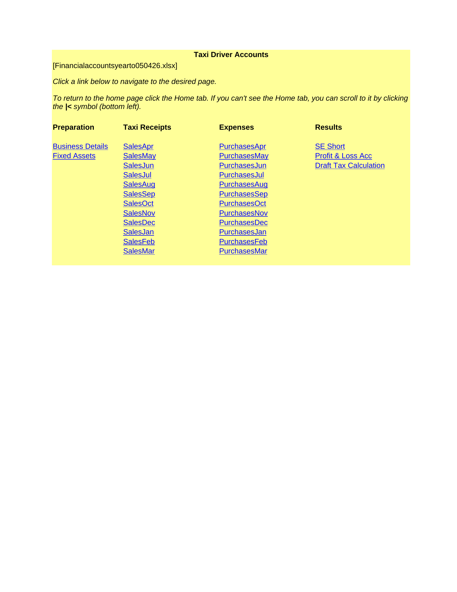
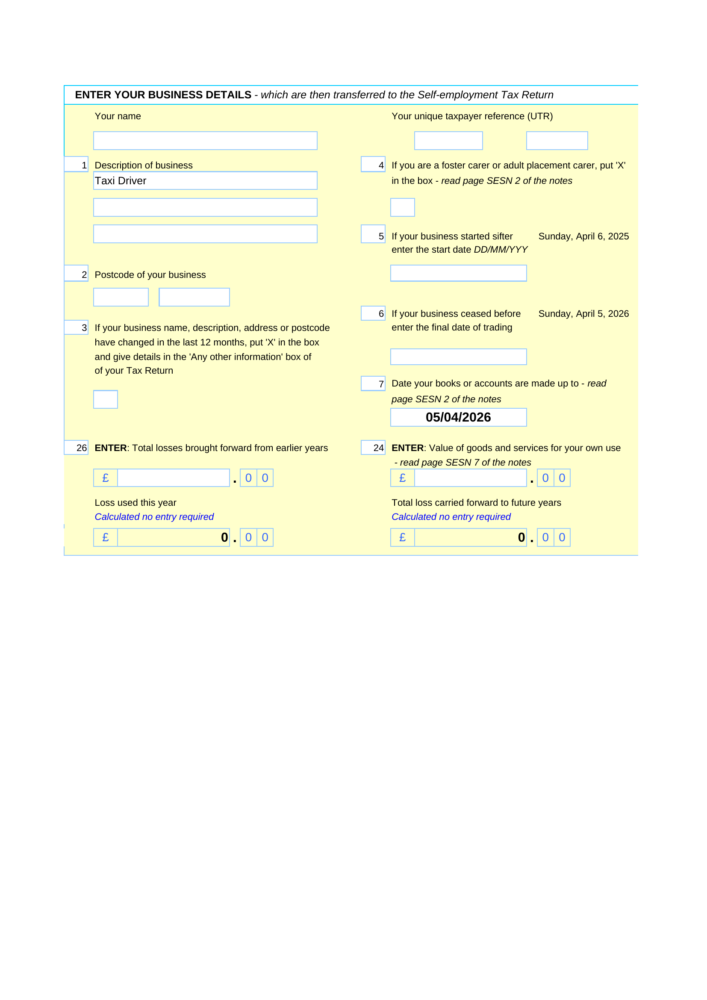
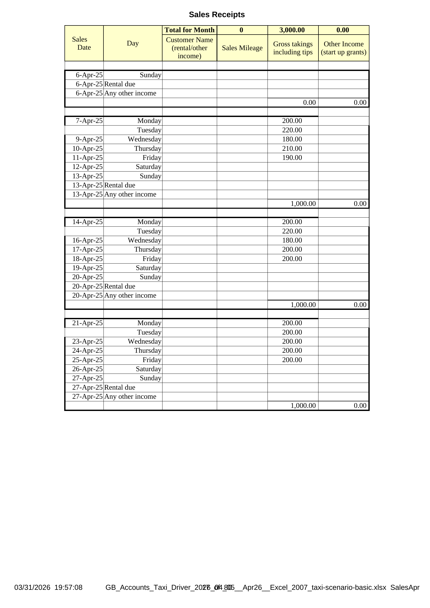
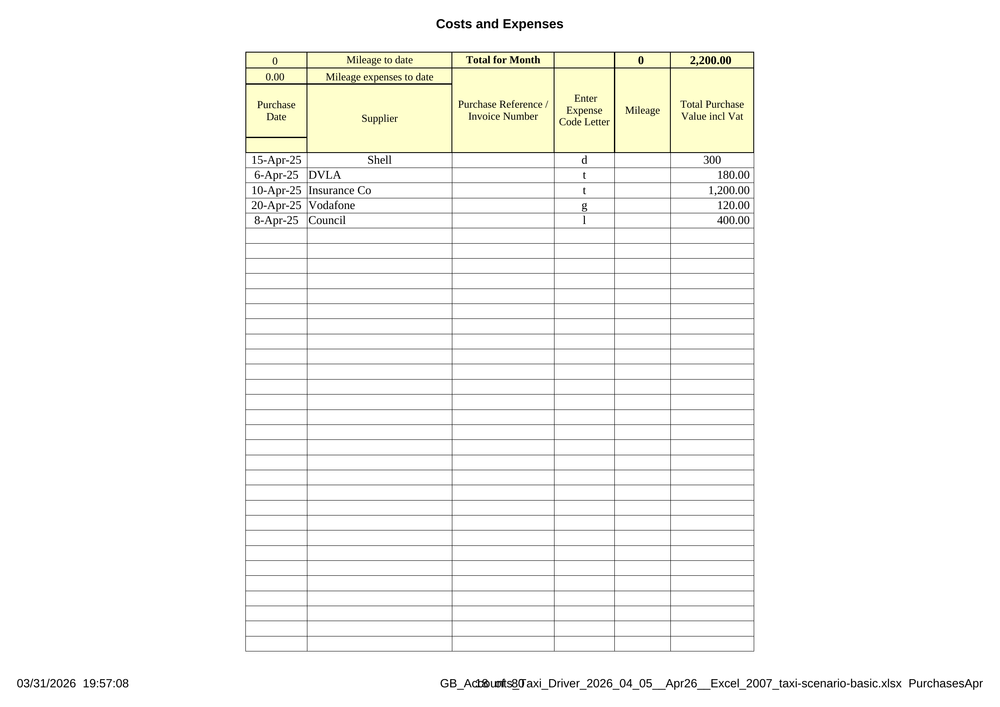
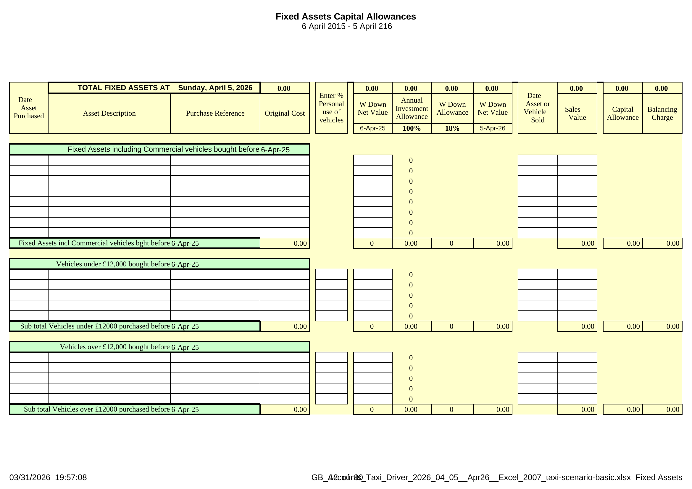
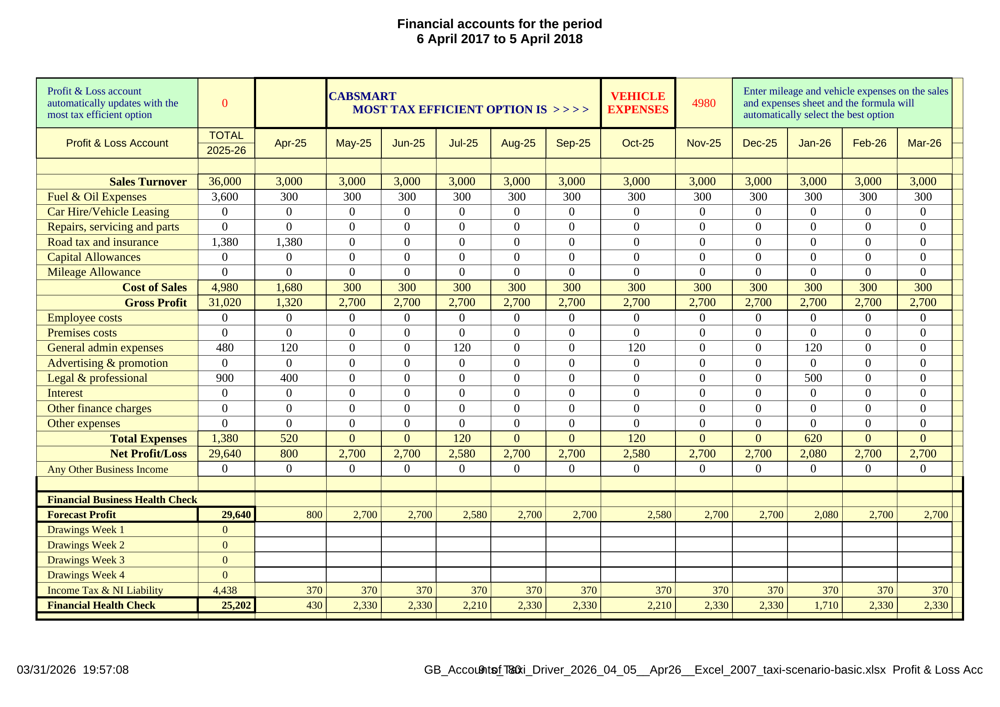
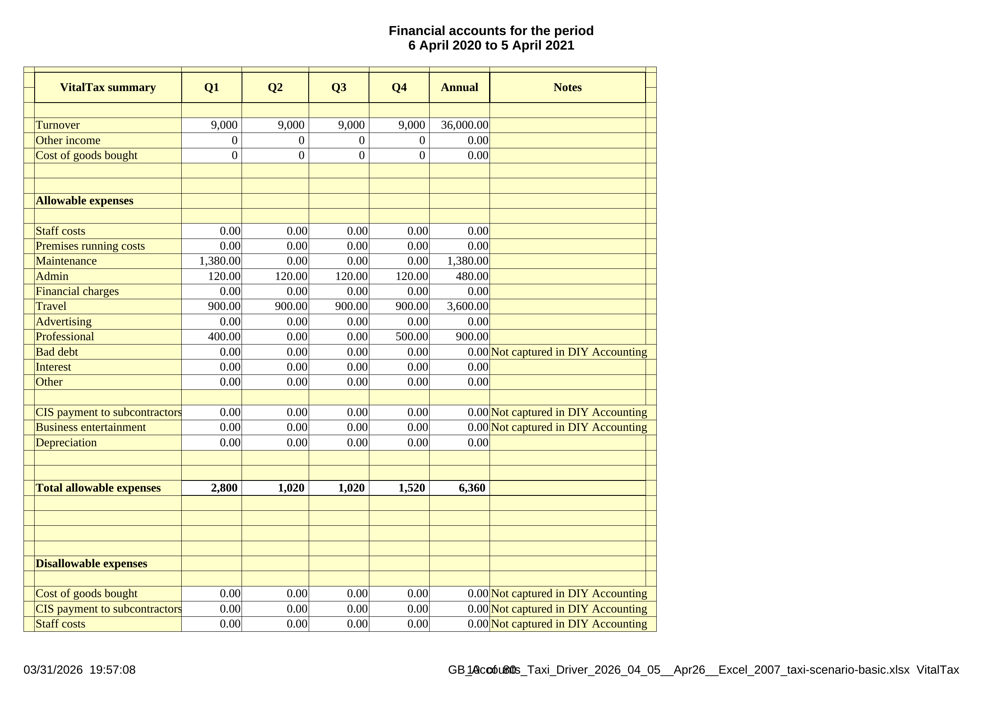
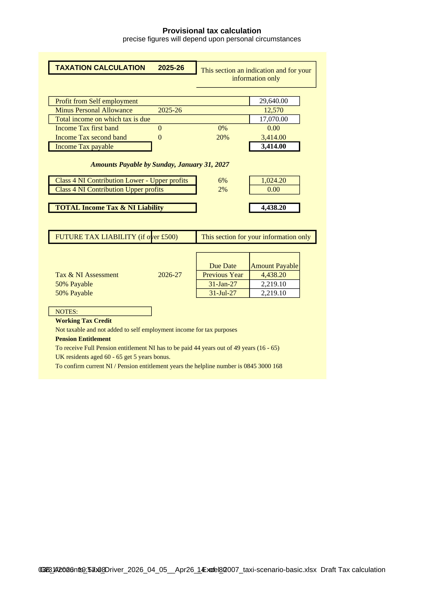
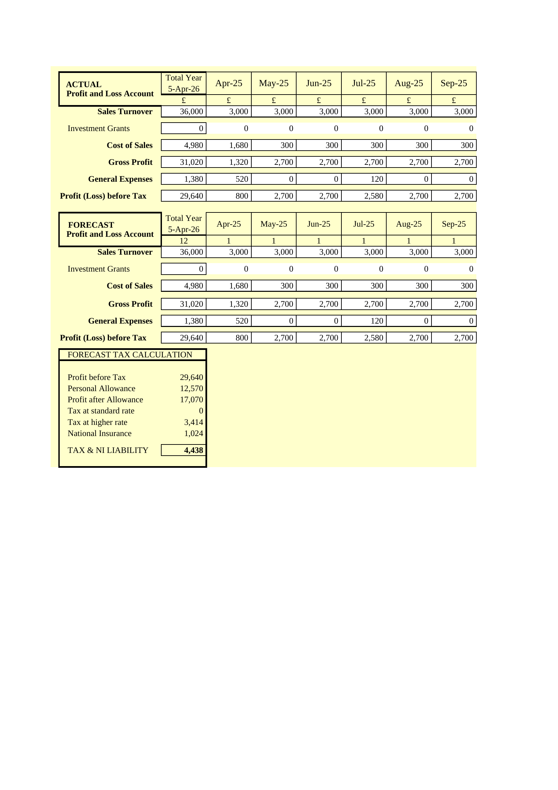
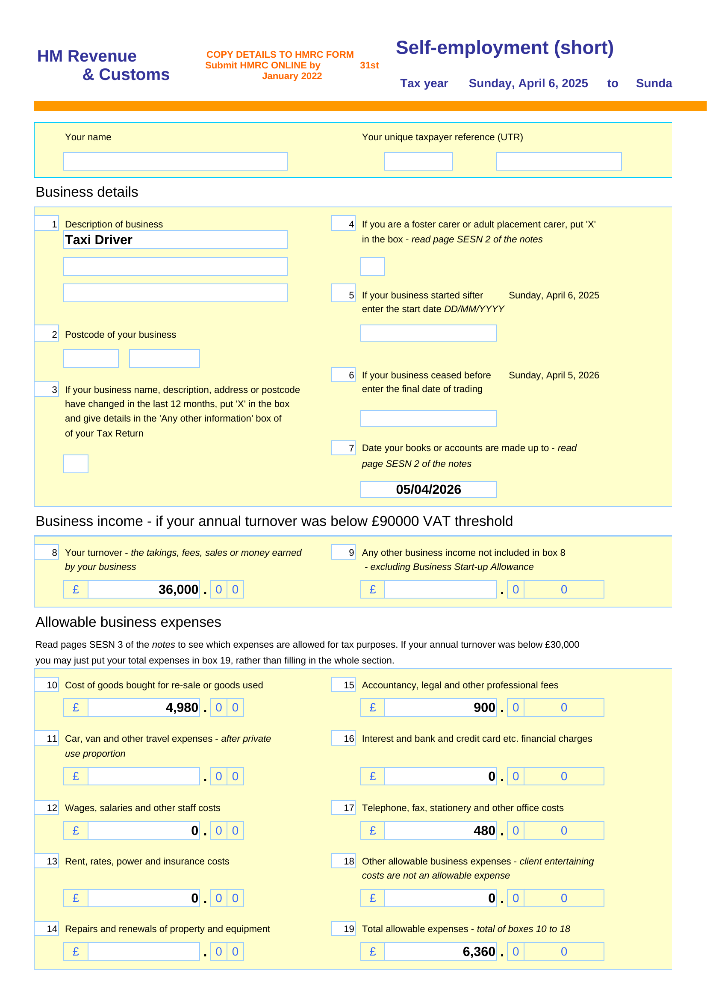

# DIY Accounting Taxi Driver User Guide

Thank you for using DIY Accounting as your accounting system.

Written upon excel spreadsheets the Cabsmart accounting system is based upon single entry accounting principles which has been automated through use of excel formulae significantly reducing the need for bookkeeping or accounting knowledge with all accounting entries automated.

Entering the data is no more complicated than entering your financial information in 3 lists:

- Enter sales receipts on the **Taxi Receipts** spreadsheet.
- Enter expenses on the **Expenses** spreadsheet.
- Enter vehicle purchases and sales on the **Fixed Assets** spreadsheet.

Designed to be fast and easy to enter the accounting system is formula driven so that minimum data is entered with automated analysis producing monthly profit & loss accounts, and an excel copy of the all important self assessment tax return ready for printing and copying to the Inland Revenue paper copy or filing directly online.

## Contents

- [Getting Started](#getting-started)
- [Preparing to Get Started](#preparing-to-get-started)
- [Protection and Parameters](#protection-and-parameters)
- [Taxi Receipts Spreadsheet](#taxi-receipts-spreadsheet)
- [Expenses Spreadsheet](#expenses-spreadsheet)
- [Financial Accounts](#financial-accounts)
- [Taxation](#taxation)
- [Contact Information](#contact-information)
- [Glossary: Expense Column Headings](#glossary-expense-column-headings)

## Getting Started

This section details the steps required to install and run DIY Accounting Taxi Driver.

### Download and Install

1. Go to the download page on the DIY Accounting website.
2. Download the package for your version of Excel.
3. Save the zip file to a location on your computer, ideally in your Documents folder.
4. Extract the contents of the zip file to a new folder by right clicking on the zip file and selecting "Extract All".
5. Open the extracted folder — you will find the spreadsheet file and this guide.

### Open the Spreadsheet

1. Open the financial accounts spreadsheet file.
2. If prompted about macros or protected view, click "Enable Editing" and/or "Enable Content".
3. The **Home** sheet provides navigation links to all worksheets.
4. Click any link on the Home sheet to navigate to that worksheet.

The Home sheet organises the worksheets into four groups:

| Preparation | Taxi Receipts | Expenses | Results |
|-------------|--------------|----------|---------|
| Business Details | SalesApr – SalesMar | PurchasesApr – PurchasesMar | SE Short |
| Fixed Assets | | | Profit & Loss Acc |
| | | | Draft Tax Calculation |

You can also navigate between sheets using the tabs along the bottom of the Excel window.

### First Entries

To get started with your first month of accounting:

1. Navigate to the **SalesApr** sheet (or the first month of your tax year).
2. Enter your daily taxi fares alongside the pre-filled dates.
3. Navigate to the **PurchasesApr** sheet.
4. Enter your expense transactions following the column guide below.
5. Check the **Profit & Loss Acc** sheet — your entries should appear automatically.

### Back Up

It is important to back up data at regular intervals. It is recommended that the files are backed up each week by emailing the files to yourself and then filing the most recently emailed files in a separate folder in your mail box.

## Preparing to Get Started

Before starting entries to the worksheets there is a small amount of customisation to be carried out in relation to updating of accounting information relating to vehicles that existed at the start of the financial year.

### Business Details

The **Business Details** sheet captures your business information — name, postcode, business start date, and accounts date. These details are transferred to the Self-Employment Tax Return.

### Existing Vehicles

Enter in the green shaded area details of existing vehicles at the start of the financial year require updating on the fixed asset schedule located in the Financial Accounts workbook on the **Fixed Assets** sheet.

The fixed asset schedule requires to be updated with the assets existing at the start of the financial year. There are 3 categories of existing assets to be recorded:

- Other Fixed Assets bought before the tax year start
- Vehicles under 12,000 bought before the tax year start
- Vehicles over 12,000 bought before the tax year start

Record only assets purchased prior to the tax year start in the green area. For vehicles record the make and model, registration mark, purchase invoice details, the original purchase cost and the date purchased. If you have more than one vehicle enter each separately and note vehicles costing over 12,000 are treated differently for tax purposes than vehicles costing under 12,000, capital allowances being restricted to a maximum of 3,000 p.a.

If the vehicle is also used for personal as well as business purposes then enter the percentage of private use based upon mileage covered in column F. This "private use percentage" has the effect of reducing the level of capital allowances claimed by the percentage entered in column F.

If any of these assets have previously been the subject of a capital allowance by yourself it is also necessary to record the Written Down Value at the start of the tax year. Written Down Value is the purchase cost of the asset less capital allowances already claimed. If you know the written down value of your vehicle from last years financial accounts, then enter that amount in column H against the appropriate asset/vehicle details. If you do not know the written down value then your accountant should be able to provide this figure. If you have never claimed capital allowances on your vehicle the written down value is the same figure as the original purchase cost.

## Protection and Parameters

### Worksheet Protection

Financial Accounts spreadsheets are protected to preserve the formulae. A protection password was not used except on the self assessment tax return which is password protected. The password is not provided for copyright reasons.

To unprotect a sheet, go to the menu bar:

- Click **Tools > Protection > Unprotect Sheet** (or **Review > Unprotect Sheet** in modern Excel)

The data entry spreadsheets Taxi receipts and Expenses have not been protected. A manual entry in any cell containing a formula will overwrite that formula. Only enter data in cells that do not contain formulae.

Create a back-up copy of your spreadsheets for use as a test model and also provide a source from which any formula driven cells subsequently overwritten may be replaced.

### Formulae Parameters

Preset formulae have been entered in the monthly Expenses spreadsheets down to row 204. This allows up to 200 purchase transactions to be entered each month and analysed which is sufficient for all known self employed taxi drivers.

If the number of purchase transactions exceeds 200 in any month the formulae will require extending to the additional rows used. To extend the formula driven cells click each formula bearing cell in the row, place the cursor on the bottom right hand corner of the cell, a + appears, click and drag the + down to the required row number. Note do NOT click and drag formula cells ACROSS the page as this destroys the formulae.

### Column Totals

There is no need to change the formula in row 1 which totals each column as this has been preset on both the sales and purchase spreadsheets to add up all cells in each column down to row 999.

### Printing Parameters

Printing areas of the sales and purchase spreadsheets have been restricted to the first 68 rows. This prevents many sheets of blank pages being printed if rows below 68 are not used.

To change the printing area to suit your own requirements:

- Go to the menu option: Click **File > Page setup > Sheet**
- In the "Print area" box delete 68 and enter the number of rows to be printed

## Taxi Receipts Spreadsheet

Transactions to be recorded are from the start to the end of the tax year. There are 12 monthly sales sheets: **SalesApr**, **SalesMay**, **SalesJun**, **SalesJul**, **SalesAug**, **SalesSep**, **SalesOct**, **SalesNov**, **SalesDec**, **SalesJan**, **SalesFeb**, **SalesMar**.

Each monthly sheet has **every day of the tax year pre-filled** as rows, grouped into Monday-Sunday weeks. The tax year always starts on 6 April and ends on 5 April of the following year.

### Data Entry

The columns for entering details of your sales are A-F:

- **Column A** — Date of the sales transaction has been pre-entered for you
- **Column B** — Relevant day has been pre-entered for you
- **Column C** — Enter the customer name or source of sale if you need to keep a note of the sales source, e.g. source of other income receipts or the name of rent due
- **Column D** — Enter the mileage incurred in connection with the days sale. Note you may only claim mileage allowances if you are not claiming motoring costs such as the vehicle cost, repairs, tax, insurance, or fuel. If you wish to claim vehicle expenses rather than mileage allowance leave this column blank. It is recommended that you record the daily mileage to enable the most tax beneficial option to be selected
- **Column E** — Enter the total amount of fares received including any gratuities
- **Column F** — Enter other income such as business start up grants. Note do not include any amounts recorded in this column in column E as they do not form part of business turnover and are accounted for separately on the self assessment tax return

Note: Accurate mileage claims are important as should HMRC subsequently inquire into your tax return they may request documents such as MOT certificates to check the total mileage and would certainly test whether the mileage was consistent with the amount of sales received.

### Weekly Structure

Each week in the Sales sheets runs Monday to Sunday. At the end of each week (Sunday), two additional rows appear:

- **Rental due** — for recording weekly taxi rental payments
- **Any other income** — for any other income received that week

A weekly subtotal row follows, automatically summing the week's fares and other income.

### What Happens to the Information Entered?

Row 1 totals each column. The totals of each sheet are then collected by the financial accounting spreadsheet to produce the monthly profit and loss account and self assessment tax return. The sales mileage if recorded is also automatically transferred to the purchases spreadsheet which adds the sales mileage to the purchase mileage and calculates the mileage allowance.

## Expenses Spreadsheet

Transactions to be recorded are from the start to the end of the tax year. There are 12 monthly purchase sheets: **PurchasesApr**, **PurchasesMay**, **PurchasesJun**, **PurchasesJul**, **PurchasesAug**, **PurchasesSep**, **PurchasesOct**, **PurchasesNov**, **PurchasesDec**, **PurchasesJan**, **PurchasesFeb**, **PurchasesMar**.

### Data Entry

The columns for entering details of your purchases are A-F and T-V.

- **Column A** — Enter the date of the purchase transaction
- **Column B** — Enter the supplier's name or source of purchase
- **Column C** — Enter your reference number of the transaction or purchase invoice number
- **Column D** — Enter a single letter to identify the type of expenditure in the expense code column to automatically update the expense analysis. Eligible letters and definitions of column headings are shown in the [glossary](#glossary-expense-column-headings). Entry of this expense code is mandatory
- **Column E** — Enter the mileage incurred in connection with the purchase. Should a journey be completed without a purchase enter the date and nature of the journey on a separate line excluding sales mileage that can be entered on the sales spreadsheet. You may only claim mileage allowances if you are not claiming vehicle running costs such as the vehicle cost, repairs, tax, insurance, or fuel. It is recommended that you include both vehicle running costs and mileage covered on the expense sheet as this enables the cost comparison to be made in the Profit & Loss Account
- **Column F** — Enter the gross purchase value of the transaction including Vat
- **Column T** — Enter a concise description of the vehicle. This description will be useful when completing the capital allowance worksheet which is located within financial accounts

### Formulae Driven Automated Columns

No entries required in these columns:

- **Columns G-S** — The letters entered in column D automatically update the expense analysis

### Mileage Allowances

Purchase and sales mileage are calculated, totalled and included as a business expense on row 4. No manual entry is required on row 4 as it has been automated. The formulae in respect of mileage allowances automatically calculate the amount in accordance with current HMRC rates of 45p for the first 10,000 miles and 25p per mile thereafter.

## Financial Accounts

### Fixed Assets — Capital Allowances

Vehicle depreciation has not been calculated in the accounting system since it has no effect on the business tax, depreciation is disallowed as an expense. Instead the business receives tax allowances on the cost of assets, vehicles, to set against its profit.

Currently 18% of the cost of the vehicle, restricted to a maximum of 3,000 for vehicles costing over 12,000, can be set off against profits in the year purchased. First Year Allowances are not applicable to cars except vans which being commercial vehicles as are hackney cabs and included in the other assets section and attract the 100% annual investment allowance. The remaining value of vehicles is written off against future years profits at 20% of the book value remaining, again restricted for vehicles costing over 12,000.

#### Data Entry

Enter details of vehicles purchased during the year in the blue shaded area. Enter the details of each vehicle on a separate row. Other cream shaded areas contain complex formulae that should NOT be overwritten.

- **Column A** — Enter date vehicle or asset purchased
- **Column B** — Enter vehicle make and model and registration number
- **Column C** — Enter invoice number or other purchase reference
- **Column D** — Enter amount paid for the vehicle
- **Column F** — Enter the percentage of private use of the vehicle which will automatically restrict the capital allowances calculated on this worksheet
- **Column H** — No entries required in this column as the written down value of the vehicle is not calculated until the end of the tax year in which it was purchased. Enter of written down values are ONLY required for vehicles existing at the start of the financial year

If the vehicle is sold during the financial year:

- **Column M** — Enter the date vehicle sold in the yellow shaded area
- **Column N** — Enter amount received for the vehicle in the yellow shaded area

#### Formulae Driven Automated Columns

No entries required:

- **Column I** — Automatically calculates the first year allowance
- **Column J** — Automatically calculates the writing down allowance
- **Column P** — Automatically calculates any additional capital allowance applicable if the vehicle has been sold at a price below the tax written down value
- **Column O** — Automatically calculates the balancing charge, this is the amount of capital allowances already claimed that have to be written back if the vehicle has been sold at a price higher than the net written down value for tax purposes

### Profit and Loss Account

This worksheet has been protected as no manual entries are required. It is fully automated.

All the financial information is generated automatically from the sales, purchases and payroll sheets each month to produce a monthly profit and loss account and the annual result to date.

The Profit & Loss Acc sheet shows:

- **Sales Turnover** — monthly and annual total from all SalesApr-SalesMar sheets
- **Vehicle expenses** — fuel & oil, car hire, repairs, road tax & insurance, capital allowances, mileage allowance
- **Cost of Sales** — total vehicle running costs
- **Gross Profit** — sales less cost of sales
- **General Expenses** — employee, premises, admin, advertising, legal, interest, bank charges, other
- **Net Profit/Loss** — gross profit less total expenses
- **Financial Health Check** — forecast profit, drawings, income tax & NI liability

Its usefulness is to enable progress to a successful financial result to be monitored and should banks or other institutions request up to date accounts then you have exactly that at the touch of a print button.

### Vehicle Cost Comparison

The heading of the profit & loss account worksheet automatically compares your vehicle running costs including capital allowances with a mileage expense claim and automatically selects which method — vehicle costs or mileage — is the most tax efficient option. The message displayed advises of the option selected.

It is recommended you continue to enter both until the financial year end in case circumstances change, if for example a new vehicle is purchased. You cannot claim both mileage and vehicle expenses and the formula in the spreadsheets prevent this by choosing the most tax efficient option from the information entered.

### VitalTax Summary

No entries required. The VitalTax sheet provides a quarterly summary of your business performance, breaking down turnover, expenses, and profit by quarter.

### Draft Tax Calculation

No entries required. Fully automated and available in real time to determine the Income Tax and National Insurance contributions payable.

The Draft Tax calculation sheet shows:

- **Profit from Self employment** — carried from the Profit & Loss Acc sheet
- **Personal Allowance** — the tax-free amount for the tax year
- **Income Tax** — calculated at the basic and higher rate bands
- **Class 4 National Insurance** — calculated on profits above the lower threshold
- **Total Income Tax & NI Liability** — the combined amount due
- **Future Tax Liability** — payment on account dates and amounts

### Wages Forecast

No entries required. Fully automated and available in real time to determine the Income Tax and National Insurance contributions based upon an automated forecast of the annual profit or loss. The forecast collects the actual profit or loss each month and calculates the average profit or loss based upon the actual months and automatically enters these amounts in future months. This enables an automated calculation of the likely year end liability for tax and national insurance which is then entered on the Profit & Loss Account in the financial health check section.

### Self Employment Tax Return (Short)

No entries are required. All the information is updated automatically from the worksheets. This sheet is password protected to prevent manual entries and protect copyright.

This return is provided to assist in the completion of the year end self employed section of the tax return. All box references on this document are the same as the actual tax return. The SE Short sheet includes:

- **Business details** — description, postcode, start/cease dates, accounts date
- **Business income** — turnover (box 8) and other business income (box 9)
- **Allowable business expenses** — boxes 10-19 populated from the expense analysis
- **Net profit or loss** — box 20 (profit) or box 21 (loss)
- **Tax allowances** — capital allowances from the Fixed Assets sheet
- **Taxable profit** — box 27, net business profit for tax purposes

## Taxation

### Expense Guidance Notes

The HMRC rules for employees/directors claiming expenses are quite strict since they recognise this area as a potential source of tax avoidance.

#### To Comply with HMRC Criteria

- Every expense item should ideally be receipted
- Mileage records have to be maintained showing date of journey, reason for journey and mileage covered
- Expenses covering non-employees have to be excluded
- Round sum allowances excluding permitted amounts are extremely frowned upon
- Only the business element of landline and mobile phone bills may be reclaimed
- Only the business element of household bills may be claimed
- Amounts relating to a different business may not be claimed

### Mileage Allowances

Everyone can claim as an alternative to vehicle running costs mileage allowances of 45p for the first 10,000 miles and 25p per mile thereafter. The formulae in the spreadsheets automatically calculate these rates. You may not claim mileage allowance and vehicle running costs. Should you choose to claim the mileage allowance then keep good records of mileage covered, purpose of journey. You might consider entering the mileage against sales or purchase invoices which naturally provides the date and purpose of the journey.

### Travel & Subsistence Allowances

- You may claim a lunch allowance of 5 or the receipted amount if larger, provided there is only yourself present at lunch and you are away from your normal workplace for more than 5 hours
- You may claim a dinner allowance of 10 or the receipted amount if larger, provided there is only yourself present at dinner and you are away from your normal workplace for more than 10 hours
- If you stay away from home overnight you may claim a subsistence allowance of 5 per night to cover incidental expenditure, all other expenditure being receipted. This allowance is increased to 10 if the overnight stay is out of the UK
- If you stay at a friend or relatives house instead of a hotel you may claim an allowance of 25 per night

### Household Expenses

You may claim a proportion of household expenses appropriate to the area of your home used for business purposes. If you claim domestic expenses then specific rooms should be designated as business only. For example, if you reside in a 3 bed-roomed house with a lounge and dining room, ignoring the kitchen and bathroom you have 5 rooms. If one bedroom is used as a store room and the dining room used exclusively as an office then 2 rooms are designated as business use. It would be appropriate for 2/5 of domestic costs to be claimed as a business expense. Use a single room exclusively for business purposes and you could claim 1/5 of the domestic bills.

Domestic bills would be heat & power costs — gas & electricity, rent, general & water rates. If you own the property you can claim mortgage interest (not the capital element) although this is not advised as should you claim mortgage interest HMRC can claim the same proportion of any profit made on that property as a taxable profit when sold.

### Partner Assistance

Generally HMRC do not like claims being made by self-employed businesses in respect of partners' wages and normally seek to identify if this claim was real or merely tax avoidance. If partners' wages are claimed as a business expense you should be able to produce evidence that the amount claimed has actually been paid, e.g. pay by cheque to your partners' bank account. The amount paid should be consistence with the amount of work done. For a claim to succeed the partner should have performed specific duties such as the business bookkeeping, placing advertisements, answering sales calls, quoting for work, invoicing clients, delivering goods and services, etc.

## Contact Information

Our website is the first place to look for any information: https://spreadsheets.diyaccounting.co.uk/

DIY Accounting's spreadsheet packages are maintained and supported under an Open Source model. In return for allowing anyone access to our source files, we find an indefinite low-cost home at GitHub. We continue to keep the website up with downloads for up-to-date packages. This model relies upon community support (an online forum) and accepting donations instead of retaining paid staff and charging a fee.

Please raise a question in our discussion forum here: https://github.com/diy-accounting-uk/spreadsheets.diyaccounting.co.uk/discussions

Or donate to help keep the packages updated here: https://www.paypal.com/donate/?hosted_button_id=XTEQ73HM52QQW

## Glossary: Expense Column Headings

| Category | Expense Code | Purchases Column | Description |
|----------|-------------|-----------------|-------------|
| Fuel & Oil Expenses | D | G | Petrol, diesel and oil. |
| Car Hire & Vehicle Leasing Costs | H | H | Vehicle hire and leasing costs. Vehicles bought on hire purchase: separate the monthly payment between interest and capital repayment. Include HP interest only in this column. The capital element is ignored as the purchase cost of the vehicle should be recorded in Capital Allowances where the appropriate tax deductions are calculated. |
| Repairs, servicing and parts | R | I | Repairs, servicing and parts including tyres. |
| Road tax and insurance | T | J | Road tax, insurance, AA/RAC membership. |
| Employee costs | E | K | Salaries, wages, bonuses, casual staff. Do not include your own wages and national insurance costs. |
| Premises costs | P | L | Rent, business rates, water rates, light, heat, power, property insurance and security. Include any amounts of this nature for "use of home" in this column. |
| General Administrative expenses | G | M | General office expenses including telephone, postage, stationery and printing. Include payments for radio hire in this column. |
| Advertising and promotion | A | N | Advertising, promotions, mail shots and entertainment costs. |
| Legal and professional | L | O | Council taxi licence fees. Accountants, solicitors, surveyors, architects, professional indemnity insurance. Costs and fines relating to traffic offences should NOT be included as they are disallowed for tax purposes. |
| Bank Interest | I | P | Interest on finance payments and bank loans/overdrafts excluding repayment of capital. |
| Bank Charges and Leasing | B | Q | Bank charges, credit card charges, hire purchase interest and leasing payments excluding repayment of capital. |
| Other Expenses | O | R | Business expenses not included elsewhere (incl valet). |
| Fixed Assets — Motor Vehicles | F | S | Vehicles used for business purposes. |
